# 🧠 Cybersecurity Awareness and Training Tool for SMEs using NCSC Cyber Essentials Certification

## 📌 Overview

This project develops a cybersecurity awareness and training platform specifically tailored to **Small and Medium Enterprises (SMEs)**, leveraging the **National Cyber Security Centre (NCSC)** Cyber Essentials Certification. The platform was built using **Moodle LMS**, with custom training modules, interactive assessments, progress tracking, and SSL-based secure access. It aims to equip SMEs with the foundational knowledge and tools necessary to defend their digital assets against evolving cyber threats.


## 🧩 Key Features

- ✅ Moodle-based Learning Management System
- ✅ Modules aligned with NCSC Cyber Essentials (firewalls, malware, access control, etc.)
- ✅ Locked module progression for enforced learning paths
- ✅ Integrated quizzes and final assessments
- ✅ HTTPS enforced with OpenSSL self-signed certificate
- ✅ User role management (Admin, Instructor, Student)
- ✅ Progress tracking, detailed reports, badges, and messaging tools
- ✅ Evaluation with 10 participants and feedback-driven design


## 🧠 System Architecture

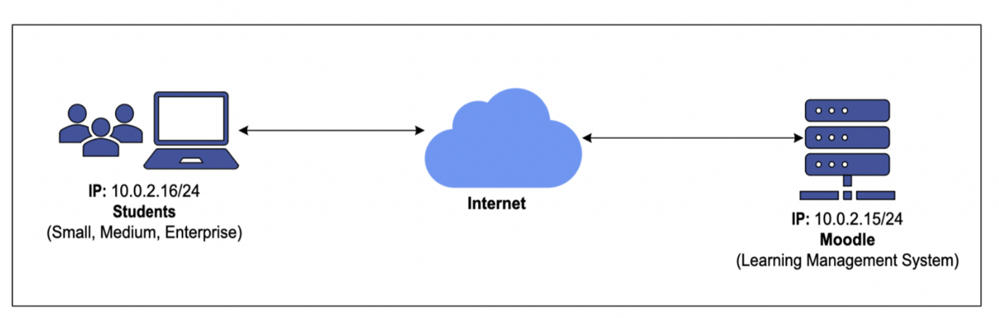
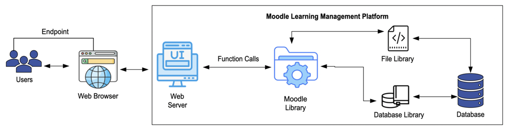


## 📚 Course Structure

| Module No. | Topic                         | Description                                                                 |
|------------|-------------------------------|-----------------------------------------------------------------------------|
| 1          | Course Overview               | Introduction to cybersecurity and course objectives                        |
| 2          | Firewalls & Internet Gateways | Network perimeter defense with Cisco & NCSC practices                      |
| 3          | Access Control                | Authentication, authorization, privilege models                            |
| 4          | Malware Protection            | Techniques for identifying and preventing malware                          |
| 5          | Patch Management              | Best practices for software updates and system hardening                   |
| 6          | Secure Configuration          | Principles for safe default settings, disabling unused services            |

Each module ends with a quiz, and users must complete one module before accessing the next.


## 🖼️ Course Demo Screenshots

### LMS Dashboard & Navigation

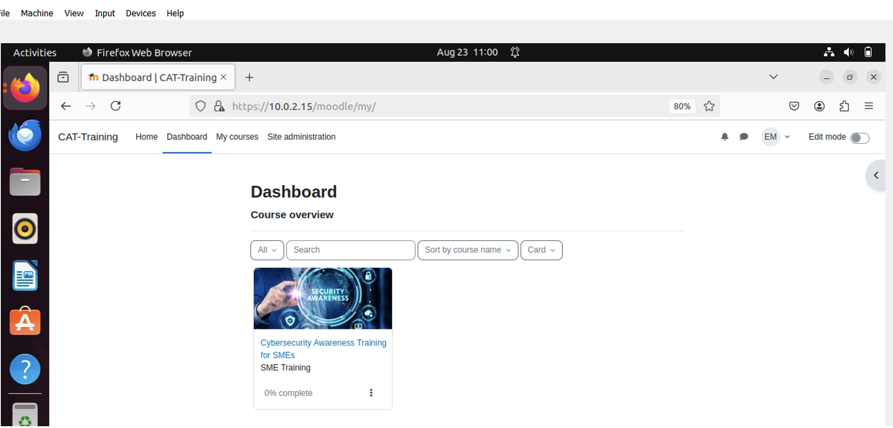

### User Roles & Permissions

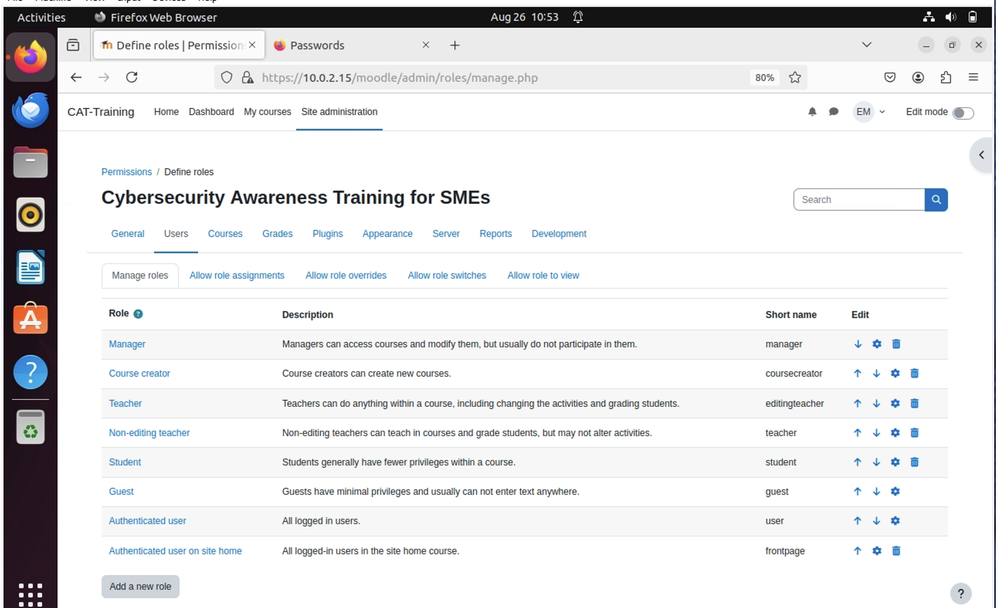

### Quizzes and Assessments

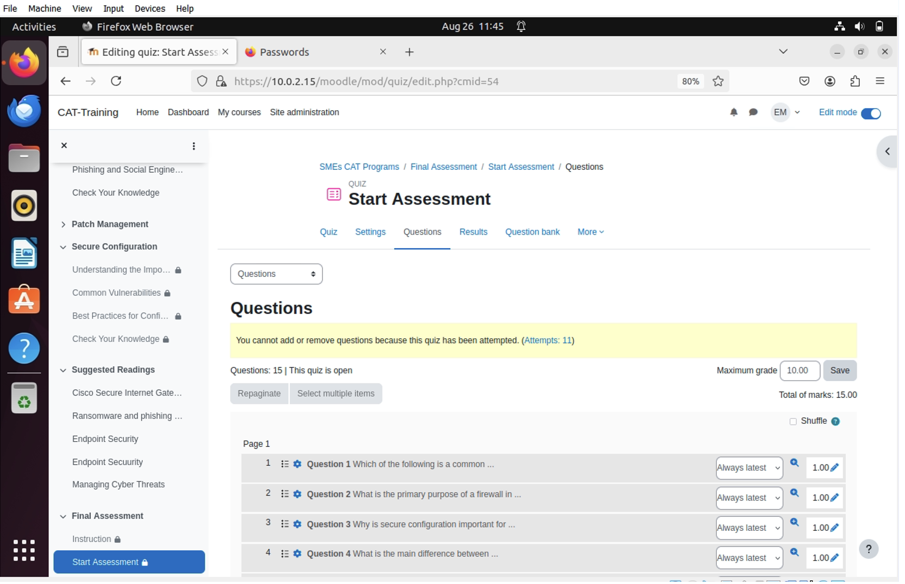
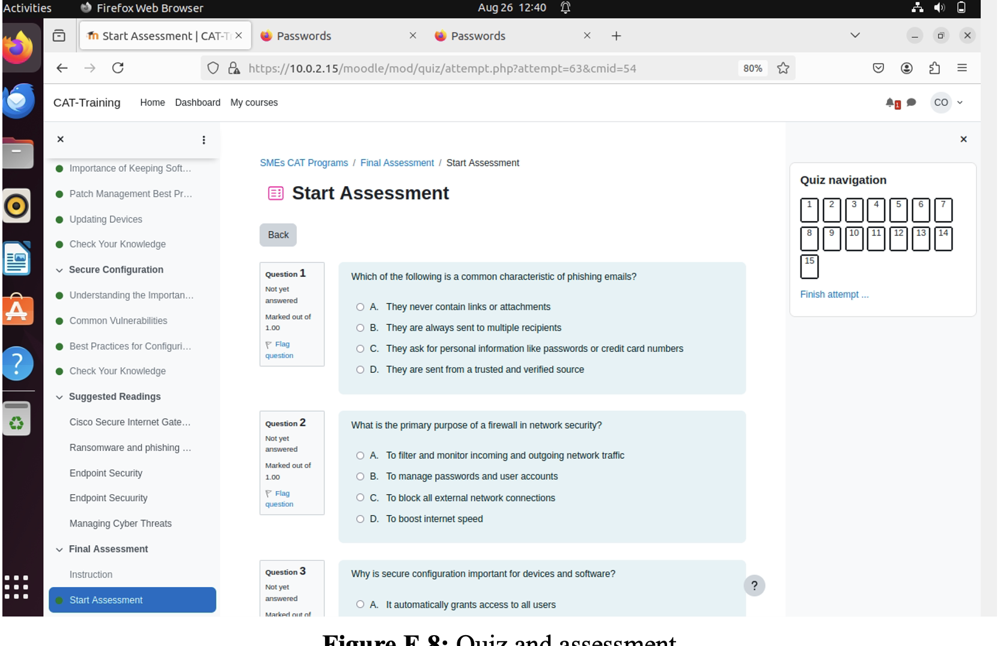


## 🔒 SSL Configuration

### HTTPS Setup and Certificates

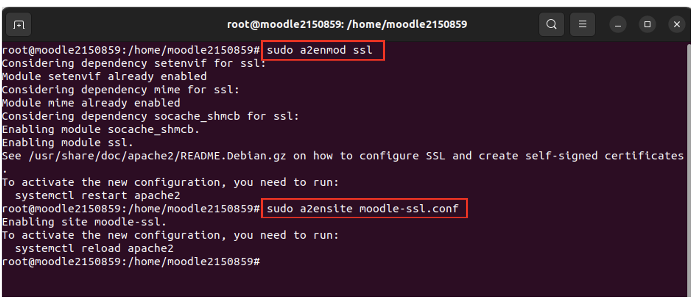
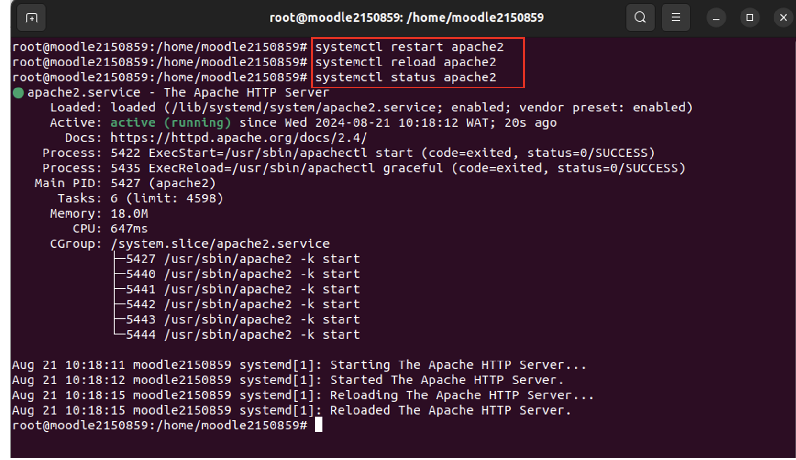


## 📈 Progress Tracking & Reports

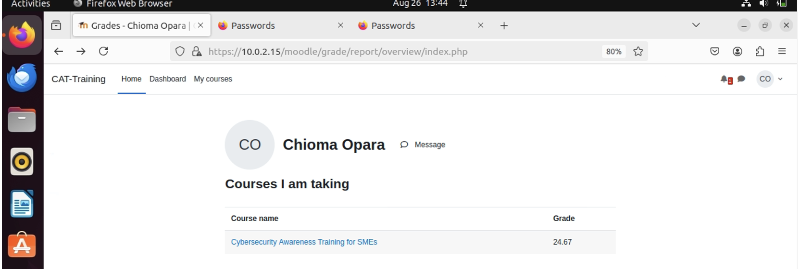
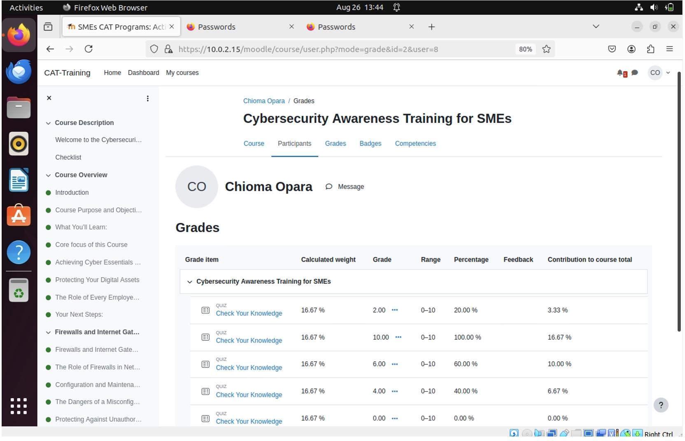


## 💬 Messaging & Forum

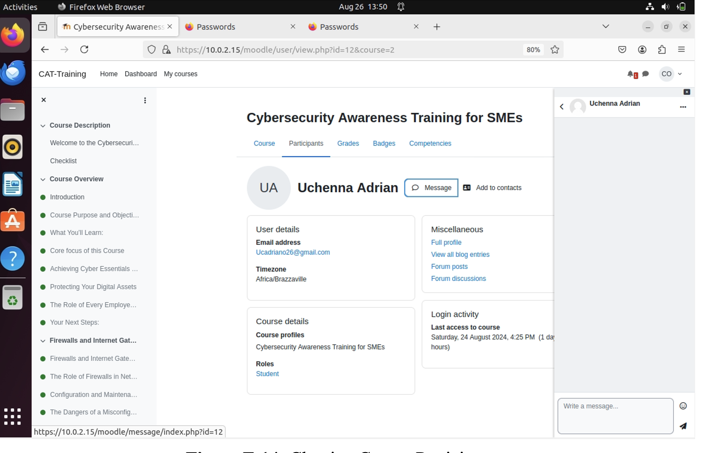


## 🧪 System Evaluation

### Functional Testing (10 Participants)

| Area                             | Result             |
|----------------------------------|--------------------|
| Registration/Login               | 100% success       |
| Quiz Relevance                   | 100% relevant      |
| Additional Resources             | 90% useful         |
| System Responsiveness            | 100% rated fast    |
| HTTPS Awareness                  | 90% aware          |
| Confidence in Digital Certificates | 80% confident    |


## 🛠️ Installation Guide

### Prerequisites

- Oracle VirtualBox  
- Ubuntu OS ISO  
- Moodle 4.4.2+  
- Apache, PHP, MySQL  

### Moodle Setup
```bash
# Install dependencies
sudo apt update
sudo apt install -y mysql-server apache2 php libapache2-mod-php php-mysql php-gd php-xml php-intl php-soap php-curl php-zip php-mbstring unzip

# Download and extract Moodle
wget https://download.moodle.org/latest.zip
unzip latest.zip -d /var/www/html/
chown -R www-data:www-data /var/www/html/moodle

# Create MySQL DB and user
sudo mysql -u root -p
CREATE DATABASE moodle DEFAULT CHARACTER SET utf8mb4 COLLATE utf8mb4_unicode_ci;
CREATE USER 'moodleuser'@'localhost' IDENTIFIED BY 'StrongPassword';
GRANT ALL PRIVILEGES ON moodle.* TO 'moodleuser'@'localhost';
FLUSH PRIVILEGES;
exit;
```

### Apache SSL Setup
```bash
# Create SSL directory
sudo mkdir /etc/apache2/ssl

# Generate self-signed cert
sudo openssl req -x509 -nodes -days 365 -newkey rsa:2048 \
-keyout /etc/apache2/ssl/moodle.key \
-out /etc/apache2/ssl/moodle.crt

# Enable SSL config
sudo a2enmod ssl
sudo a2ensite moodle-ssl.conf
sudo systemctl restart apache2
```

Update `config.php`:
```php
$CFG->wwwroot = 'https://your-ip/moodle';
```


## 🧾 Admin & Student Guide Highlights

### Admins Can:
- Manage users, roles, permissions
- Create and assign courses
- Track user progress and quiz scores
- Configure SSL and enforce HTTPS

### Students Can:
- Self-register securely
- Access locked course content in order
- View quiz results and download certificates
- Chat with peers via built-in forum


## 📌 Future Work

- Expand user testing to SMEs across sectors (health, education, finance)
- Add AI-driven content delivery based on role/knowledge level
- Integrate phishing simulations and security alerts
- Add certificate auto-generation for completed users
- Extend to mobile LMS integration (Moodle mobile app)
  


## 👨🏽‍💻 Author

**Ajijola Oluwafemi Blessing**  
Cybersecurity Analyst | Researcher  
📍 United Kingdom  
📧 oluwafemiblessingajijola@gmail.com  
[](https://www.linkedin.com/in/ajijola-oluwafemi-ba839712a/)  


---

## 📄 License

This project is for academic and educational purposes.
